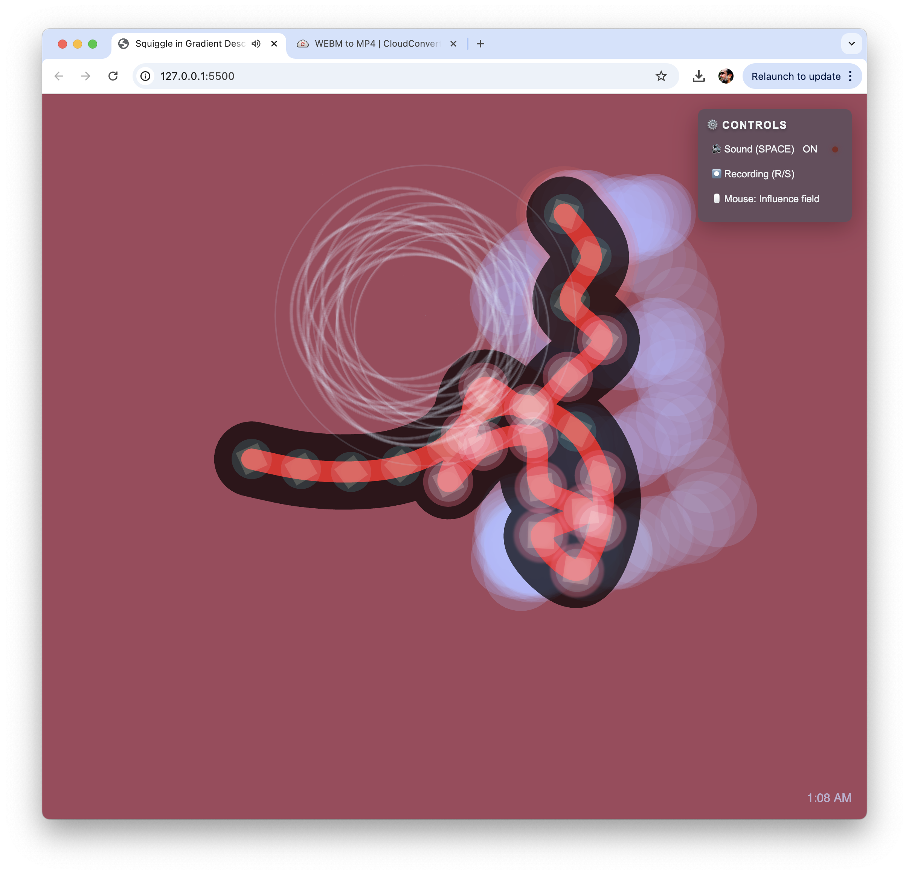

# Squiggle in Gradient Descent
## The Genesis of Interest (4.0)

A generative artwork exploring the concept of gradient descent through an autonomous organism's behavior. Like a neural network finding optimal paths, the organism continuously seeks and adapts to its environment, creating an emergent choreography of movement, sound, and light.

The organism uses principles similar to gradient descent algorithms: it explores its space, responds to environmental feedback, and adjusts its behavior based on various parameters including edge proximity, movement history, and user interaction. This creates a dynamic system where the organism appears to learn and adapt to its environment.

The piece responds to the actual time of day, creating different behaviors and visual states throughout a 24-hour cycle, much like biological circadian rhythms.

## Gallery

### Live Demo
Experience it here: [Sentient Squiggle](https://marlonbarrios.github.io/sentient_squigle/)

## Features

### Visual Elements
- Autonomous movement with edge exploration
- Segmented body with dynamic internal geometry
- Reactive glow system responding to:
  - Movement intensity
  - Edge proximity
  - User interaction
- Motion trails with:
  - Variable opacity based on speed
  - Environmental interaction
- Time-based color palette:
  - Deep Night (12-6am): Deep teal with jade glow
  - Dawn (6-9am): Sand with rust glow
  - Day (9am-5pm): Pearl with jade glow
  - Dusk (5-8pm): Rust with sand glow
  - Night (8pm-12am): Deep teal with pearl glow
- Circadian behavior patterns:
  - Night: Slower, meandering movement
  - Dawn: Gradual awakening
  - Day: Peak activity and directness
  - Dusk: Progressive settling

### Audio System
- Multi-layered sound synthesis:
  - Base oscillator for movement
  - Drone oscillators for ambience
  - Click oscillator for edge detection
  - Squeak oscillator for self-exploration
- Dynamic audio parameters based on:
  - Movement velocity
  - Curvature
  - Environmental interaction
  - Time of day variations

### Behavioral Systems
- Gradient-based movement:
  - Edge detection and exploration
  - Self-awareness through body segments
  - Velocity and direction memory
- Environmental interaction:
  - Nutrient particle system
  - Metabolic processes
  - Growth and evolution stages
- Time-influenced cycles:
  - Dynamic energy management
  - Real-time behavioral adaptation
  - Circadian rhythm simulation

## Controls
Simple and intuitive interface:
- SPACE: Toggle sound on/off
- R: Start recording
- S: Stop recording
- Mouse: Influence the field

### Color Palette
Harmonious gradient palette:
- Deep Teal (#19535f)
- Jade Green (#0b7a75)
- Warm Sand (#d7c9aa)
- Rusty Red (#7b2d26)
- Pearl White (#f0f3f5)

## Technical Details
Built with:
- p5.js for graphics
- p5.sound.js for audio synthesis
- Complex systems simulation:
  - Particle systems
  - Physics-based movement
  - Autonomous behavior algorithms
- WebM recording capability
- Minimal UI with backdrop blur

### Performance Optimizations
- Adaptive frame rate management
- Efficient particle system cleanup
- Memory usage optimization
- Dynamic quality adjustments

## Credits
Gradient descent concept and programming by Marlon Barrios Solano

Inspired by machine learning algorithms, natural phenomena, and the continuous process of finding optimal states through exploration and adaptation.

#p5 #creativecode @uf_came @ufcota

## License

[Add your license information here] 