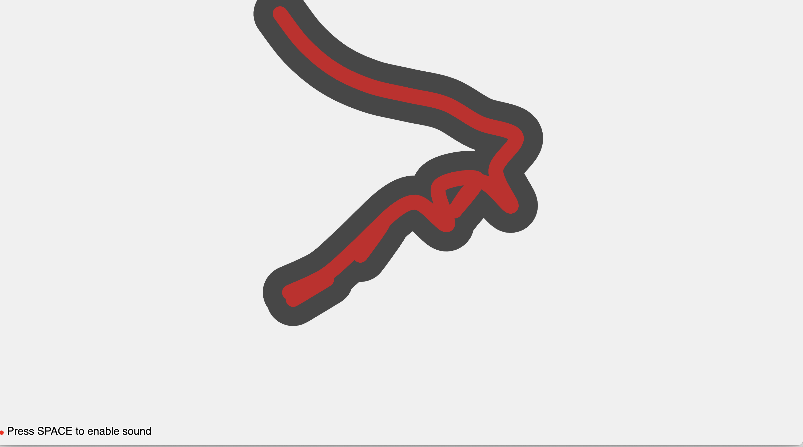

# Squiggle in Gradient Descent

An interactive audiovisual experience that explores the metaphor of gradient descent through the movement of a snake-like entity. The snake follows gradient fields while producing dynamic, movement-based sounds.

## Live Demo
[Try Squiggle in Gradient Descent Here](https://snake-soundscape.vercel.app)

## Concept
Gradient descent is a fundamental optimization algorithm used in machine learning and mathematics. It works by iteratively moving in the direction of steepest descent to find the minimum of a function. This project visualizes this concept through the movement of a snake-like form that:

- Explores its environment like a gradient descent algorithm explores a loss landscape
- "Sniffs" around edges to find optimal paths, similar to how gradient descent probes for better solutions
- Exhibits periods of rest when finding local minima
- Shows varying speeds of movement based on the "steepness" of its current position
- Evolves its behavior over time, like an optimization process refining its search

## Features
- Gradient-based autonomous movement
- Edge exploration and local minima detection
- Dynamic sound generation based on movement patterns
- Evolution of complexity over time
- Interactive influence on the gradient field
- Recording capability for capturing interesting moments

## Controls
- SPACE: Toggle sound on/off
- R: Start recording
- S: Stop recording
- Mouse: Influence the gradient field

## Technical Details
The project uses:
- Perlin noise to create smooth gradient fields
- Dynamic path finding algorithms
- Procedural audio synthesis
- Physics-based movement simulation
- Evolutionary behavior patterns

## Installation
1. Clone this repository
2. Open index.html in a web browser
3. Or serve using a local server (recommended for audio features)

## License
MIT License

Copyright (c) 2024

Permission is hereby granted, free of charge, to any person obtaining a copy
of this software and associated documentation files (the "Software"), to deal
in the Software without restriction, including without limitation the rights
to use, copy, modify, merge, publish, distribute, sublicense, and/or sell
copies of the Software, and to permit persons to whom the Software is
furnished to do so, subject to the following conditions:

The above copyright notice and this permission notice shall be included in all
copies or substantial portions of the Software.

THE SOFTWARE IS PROVIDED "AS IS", WITHOUT WARRANTY OF ANY KIND, EXPRESS OR
IMPLIED, INCLUDING BUT NOT LIMITED TO THE WARRANTIES OF MERCHANTABILITY,
FITNESS FOR A PARTICULAR PURPOSE AND NONINFRINGEMENT. IN NO EVENT SHALL THE
AUTHORS OR COPYRIGHT HOLDERS BE LIABLE FOR ANY CLAIM, DAMAGES OR OTHER
LIABILITY, WHETHER IN AN ACTION OF CONTRACT, TORT OR OTHERWISE, ARISING FROM,
OUT OF OR IN CONNECTION WITH THE SOFTWARE OR THE USE OR OTHER DEALINGS IN THE
SOFTWARE. 