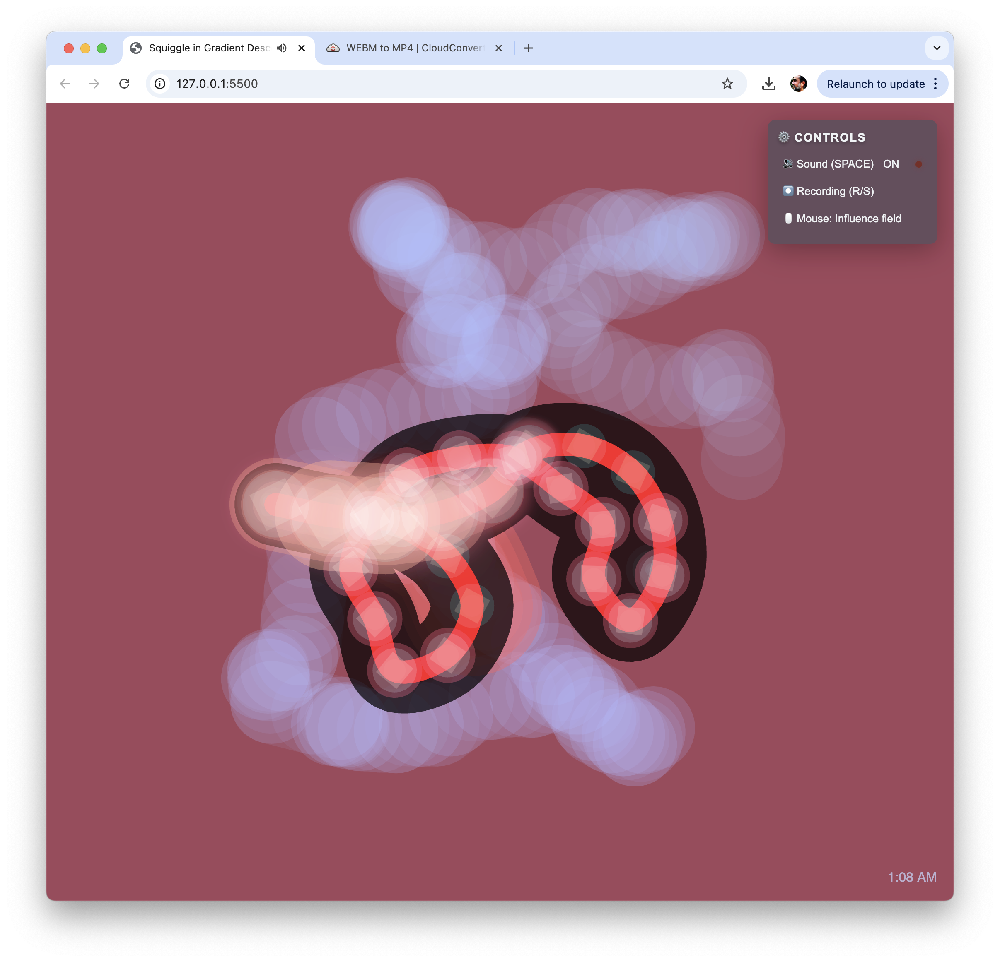

# Squiggle in Gradient Descent
## The Genesis of Interest (4.0)

A generative and interactive audiovisual experience where a snake-like form explores its environment with organic movement and generative sound. The organism autonomously navigates a dynamic space, creating evolving soundscapes based on its movement, curvature, and interactions.

## Gallery

### Live Demo
Experience it here: [Sentient Squiggle](https://marlonbarrios.github.io/sentient_squigle/)

## Features

### Visual Elements
- Autonomous movement with edge exploration
- Geometric internal patterns (alternating squares and circles)
- Dynamic glow effects and luminescent trails
- Environmental awareness and responsiveness
- Evolving complexity over time
- Time-based color transitions

### Audio System
- Generative audio triggered by movement
- Real-time sound synthesis
- Ambient sound generation
- Movement-responsive soundscapes
- Spatial audio with dynamic panning
- Procedural sound design

## Controls
Simple and intuitive interface:
- SPACE: Toggle sound on/off
- R: Start recording
- S: Stop recording
- Mouse: Influence the field

### Color Palette
Harmonious gradient palette:
- Deep Teal (#19535f)
- Jade Green (#0b7a75)
- Warm Sand (#d7c9aa)
- Rusty Red (#7b2d26)
- Pearl White (#f0f3f5)

## Technical Details
Built with:
- p5.js for graphics
- Tone.js for audio
- Real-time audio synthesis
- Procedural animation
- WebM recording capability
- Minimal UI with backdrop blur

## Credits
Gradient descent concept and programming by Marlon Barrios Solano

Inspired by natural phenomena and interactive art installations.

#p5 #creativecode @uf_came @ufcota

## License

[Add your license information here] 